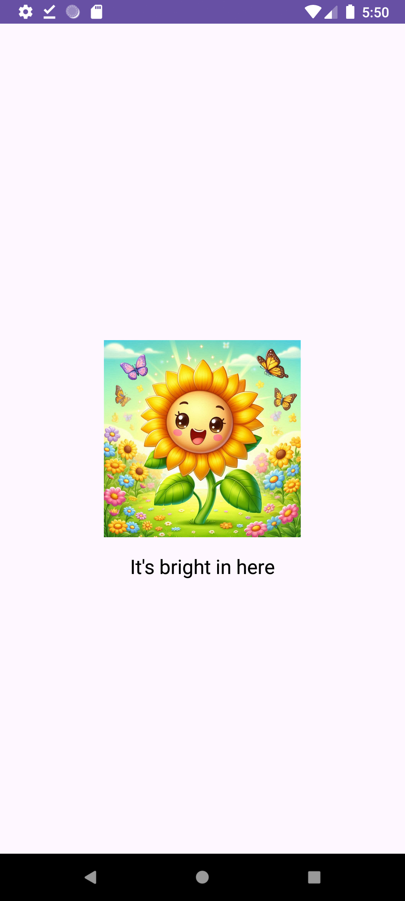
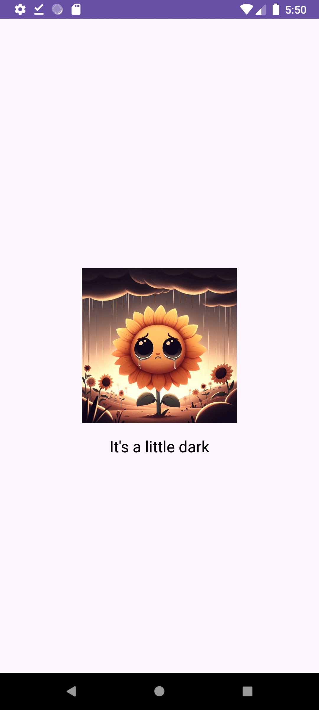

# Light Sensor Meme App 🌞🌚

This is a simple and fun Android app that uses the phone’s light sensor to switch between two animated characters depending on the ambient light level. It was developed as part of a university mobile development course.

## 📱 Features

- **Light Mode**: A sunflower character appears happy when there's enough light and sad when it's dark.
- **Dark Mode**: A vampire character appears happy in the dark and "dies" or becomes sad in the light.
- Real-time light sensor monitoring
- Instant image switching based on sensor input

## 🛠️ Tech Stack

- **Java**
- **Android Studio**
- **Light Sensor API**

## 🎓 Purpose

This app was built as a fun experiment to understand Android’s sensor framework. It was also a project for the Mobile App Development course (2024/2025).

## 🖼️ Screenshots

| Light Mode | Dark Mode |
|------------|-----------|
|  |  |

## 🚀 How to Run

## 📲 Try It Out

Download the APK directly:

👉 [Download app-debug.apk](https://github.com/Ikramik/light-sensor/releases/download/v1.0/app-debug.apk)

> Note: You may need to allow “Unknown Sources” in your Android settings.
